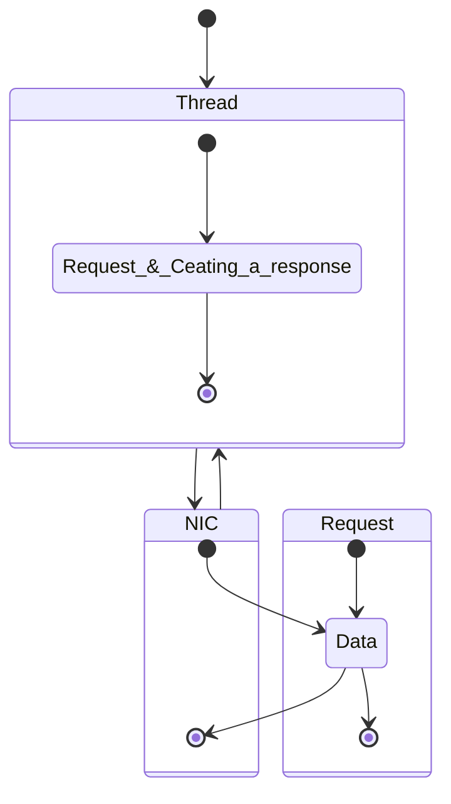

# Thread-per-Core  ( rust, async, tokio)

- 잘 설명해준 글 https://without.boats/blog/thread-per-core/


- thread-per-core는 tokio같이 async
  - Glommio (pronounced glo-mee-jow or |glomjəʊ|) is a Cooperative Thread-per-Core crate for Rust & Linux based on io_uring. Like other rust asynchronous crates, it allows one to write asynchronous code that takes advantage of rust async/await, but unlike its counterparts, it doesn't use helper threads anywhere.
    - https://github.com/DataDog/glommio
    - 관련 논문 https://penberg.org/papers/tpc-ancs19.pdf

# Latency vs Throughput | System Design Essentials | Be A Better Dev

- Latency (비슷한 개념들 Ping or Log or Connection or Delay)
  - Amount of time for a packet to be transferred across a network.
    - https://youtu.be/84ZLMbHefJI?si=FcIl7TkhGdnnNgzk
 
- Throughput(100mbps,  1Gigabit) 최대 빠른 속도를 말하는듯 
  - Amount of data that can be sent per unit time (TPS, Transactions Per Second)

# NIC란 무엇입니까?(Network interface controller)

NIC는 네트워크 인터페이스 카드라고도 하며 네트워크 인터페이스 컨트롤러라고도 합니다

https://www.fibermall.com/ko/blog/network-adapter-nics-function-construction-classification.htm

# The thread-per-core approach, discussed in §III,
- iii) the time for a response to arrive on the NIC from the thread
  - aims to reduce application latency by addressing the issues of CPU affinity, thread synchronization, and OS interfaces.

# Application latency
- NIC(Network interface controller)
https://en.wikipedia.org/wiki/Network_interface_controller

```
i) the time for the request to reach a thread after it has arrived on the NIC, 
i) 요청이 NIC에 도착한 후 스레드에 도달하는 시간, 

ii) the time for the application to process the request
ii) 신청이 요청을 처리하는 시간

iii) the time for a response to arrive on the NIC from the thread. 
스레드에서 NIC에 응답이 도착하는 시간. 

```

- The components
- i) and iii) depend on the ```OS network stack```, while

- ii) depends on ```thread synchronization for processing a request and creating a response.```



<br>

<hr>

# Java21에서 고민중인 내용

# What Solution?

- Creating several threads
  - As many as needed, that is 1M of them.


## Concurrency for I/O

- A thread is not cheap
  - Thread starup time: ~1ms 
  - Thread memory consumption: 2MB of stack
  - Context switching: ~100us(depends on the OS)

- Having 1 million platform threads is not possible

# What Solution?

1) Give each thread between 1K and 1M tasks <br>This is what reactive frameworks are doing


<hr>

<br>


<table>

</table>


# Java 21: Focus on Virtual Threads and Pattern Matching | IntelliJ IDEA by JetBrains

https://www.youtube.com/live/d_XmNicqC2I?si=_D5bQfXaja3Vei4G

# Project Loom

https://jdk.java.net/loom/

<hr>


