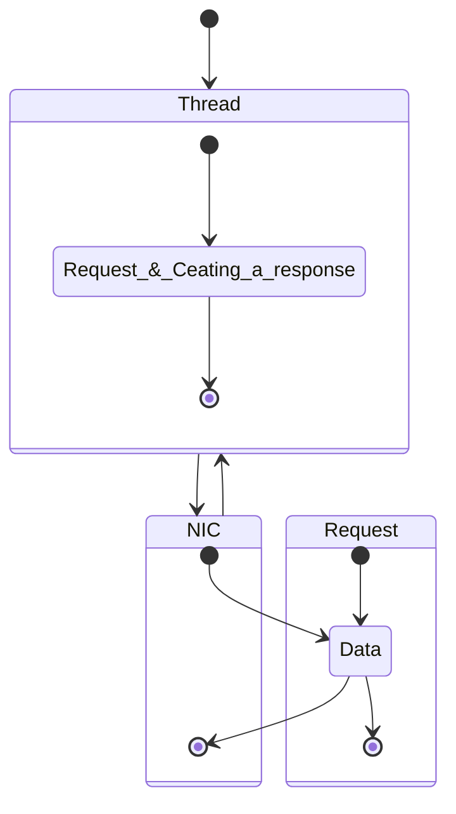

# Thread-per-Core  ( rust, async, tokio)

- 잘 설명해준 글 https://without.boats/blog/thread-per-core/


- thread-per-core는 tokio같이 async
  - Glommio (pronounced glo-mee-jow or |glomjəʊ|) is a Cooperative Thread-per-Core crate for Rust & Linux based on io_uring. Like other rust asynchronous crates, it allows one to write asynchronous code that takes advantage of rust async/await, but unlike its counterparts, it doesn't use helper threads anywhere.
    - https://github.com/DataDog/glommio
    - 관련 논문 https://penberg.org/papers/tpc-ancs19.pdf

# Latency vs Throughput | System Design Essentials | Be A Better Dev

- Latency (비슷한 개념들 Ping or Log or Connection or Delay)
  - Amount of time for a packet to be transferred across a network.
    - https://youtu.be/84ZLMbHefJI?si=FcIl7TkhGdnnNgzk
 
- Throughput(100mbps,  1Gigabit) 최대 빠른 속도를 말하는듯 
  - Amount of data that can be sent per unit time (TPS, Transactions Per Second)

# NIC란 무엇입니까?(Network interface controller)

NIC는 네트워크 인터페이스 카드라고도 하며 네트워크 인터페이스 컨트롤러라고도 합니다

https://www.fibermall.com/ko/blog/network-adapter-nics-function-construction-classification.htm

# The thread-per-core approach, discussed in §III,
- iii) the time for a response to arrive on the NIC from the thread
  - aims to reduce application latency by addressing the issues of CPU affinity, thread synchronization, and OS interfaces.

# Application latency
- NIC(Network interface controller)
https://en.wikipedia.org/wiki/Network_interface_controller

```
i) the time for the request to reach a thread after it has arrived on the NIC, 
i) 요청이 NIC에 도착한 후 스레드에 도달하는 시간, 

ii) the time for the application to process the request
ii) 신청이 요청을 처리하는 시간

iii) the time for a response to arrive on the NIC from the thread. 
스레드에서 NIC에 응답이 도착하는 시간. 

```

- The components
- i) and iii) depend on the ```OS network stack```, while

- ii) depends on ```thread synchronization for processing a request and creating a response.```



- In-kernel network stack. 

<table border="1">
    <tr>
    <td colspan="2" align="center">In-kernel network stack.  </td>
    </tr>
    <tr align="center">
        <td>
When a packet arrives on the NIC, the kernel device driver notices the new packet either by polling the NIC, or via an interrupt. The device driver allocates an in-kernel data structure for the packet, and forwards the packet to the in-kernel protocol stack. 

The protocol stack performs its processing and then notifies the application that new data
is available on one of its sockets. The notification wakes up a thread which then retrieves the new data with the recv system call, performs its application-specific logic, and sends a response using the send system call. 

The kernel then forwards the response to to the NIC via the in-kernel network stack and the device driver.
</td>

  <td>커널 내 네트워크 스택입니다.

패킷이 NIC에 도착하면 커널 장치 드라이버는 NIC를 폴링하거나 인터럽트를 통해 새 패킷을 알 수 있습니다. 장치 드라이버는 패킷에 대한 커널 내 데이터 구조를 할당하고 패킷을 커널 내 프로토콜 스택에 전달합니다.

프로토콜 스택은 해당 처리를 수행한 다음 애플리케이션에 새 데이터를 알립니다
는 소켓 중 하나에서 사용할 수 있습니다. 이 알림은 스레드를 깨운 다음 recv 시스템 호출과 함께 새로운 데이터를 검색하고 응용 프로그램별 로직을 수행한 다음 send 시스템 호출을 사용하여 응답을 보냅니다.

그런 다음 커널은 커널 내 네트워크 스택과 디바이스 드라이버를 통해 NIC에 응답을 전달합니다.</td>
    </tr>
</table>

<hr>

<br>

- CPU affinity.

<table border="1">
    <tr>
    <td colspan="2" align="center">CPU affinity.__CPU 선호도.
</td>
    </tr>
    <tr align="center">
        <td>On multicore servers, packets can bounce be-
tween up to three different CPU cores when traversing the in-kernel network stack.

 The NIC steers packet to one of its RX queues, which maps to a CPU core.

 When kernel software steering is enabled, the kernel then forwards the packet to another core which runs the in-kernel network stack.

Finally, the kernel forwards the packet to a thread which may be running on yet another CPU core. This lack of packet processing locality decreases overall performance [19], [35].

Furthermore, a thread currently servicing a request may have to yield the CPU to the in-kernel network stack, which will process a packet that is destined for another thread that is running on a different CPU core [23]. </td>
        <td>

멀티코어 서버에서는 패킷이 튕길 수 있습니다
커널 내 네트워크 스택을 통과할 때 최대 3개의 서로 다른 CPU 코어 사이를 이동할 수 있습니다.

NIC는 패킷을 CPU 코어에 매핑되는 RX 큐 중 하나로 조향합니다.

커널 소프트웨어 스티어링이 활성화되면 커널은 패킷을 커널 내 네트워크 스택을 실행하는 다른 코어로 전달합니다.

마지막으로, 커널은 또 다른 CPU 코어 상에서 실행될 수도 있는 스레드에 패킷을 포워딩합니다. 이러한 패킷 프로세싱 로컬리티의 부족은 전체 성능을 감소시킵니다 [19], [35].

또한, 현재 요청을 서비스하는 스레드는 커널 내 네트워크 스택에 CPU를 전달해야 할 수도 있습니다. 그러면 다른 CPU 코어에서 실행 중인 다른 스레드로 향하는 패킷이 처리됩니다[23].</td>
    </tr>
</table>

<hr>

<br>

- Thread synchronization.

<table border="1">
    <tr>
    <td colspan="2" align="center">Thread synchronization.__스레드 동기화.</td>
    </tr>
    <tr align="center">
        <td> Applications that run on multicore servers use threads for parallelism to fully utilize all the
available CPU cores. 

However, the threads need to synchronize
with each other to serve a given request if multiple threads access the same resources.

 This thread synchronization has two problems: 

(1) the synchronization itself has overheads that
increases request processing latency, and 

(2) it limits scalability on large multicore systems. 

Both issues can be mitigated with various approaches including data partitioning [28] and
using concurrent data structures [6], [12].
        </td>
        <td>멀티코어 서버에서 실행되는 애플리케이션은 병렬 처리를 위해 스레드를 사용하여 모든 데이터를 완벽하게 활용합니다
사용 가능한 CPU 코어.

그러나 스레드는 동기화가 필요합니다
여러 스레드가 동일한 리소스에 액세스하는 경우 주어진 요청을 처리하기 위해 서로 함께 사용합니다.

이 스레드 동기화에는 두 가지 문제가 있습니다:

(1) 동기화 자체에는 다음과 같은 오버헤드가 있습니다
요청 처리 지연 시간을 늘립니다

(2) 대규모 멀티코어 시스템에서는 확장성을 제한합니다.

데이터 파티셔닝을 포함한 다양한 접근 방식을 통해 두 문제를 완화할 수 있습니다[28]
동시 데이터 구조 사용 [6], [12]. </td>
    </tr>
</table>

<hr>

<br>


- thread synchronization.__스레드 동기화.

<table border="1">
    <tr>
    <td colspan="2" align="center">thread synchronization.__스레드 동기화. </td>
    </tr>
    <tr align="center">
        <td>Applications that run on multicore servers use threads for parallelism to fully utilize all the
available CPU cores. 

However, the threads need to synchronize
with each other to serve a given request if multiple threads access the same resources.

 This thread synchronization has two problems: 

(1) the synchronization itself has overheads that
increases request processing latency, and 

(2) it limits scalability on large multicore systems. 

Both issues can be mitigated with various approaches including data partitioning [28] and
using concurrent data structures [6], [12]. </td>
        <td>멀티코어 서버에서 실행되는 애플리케이션은 병렬 처리를 위해 스레드를 사용하여 모든 데이터를 완벽하게 활용합니다
사용 가능한 CPU 코어.

그러나 스레드는 동기화가 필요합니다
여러 스레드가 동일한 리소스에 액세스하는 경우 주어진 요청을 처리하기 위해 서로 함께 사용합니다.

이 스레드 동기화에는 두 가지 문제가 있습니다:

(1) 동기화 자체에는 다음과 같은 오버헤드가 있습니다
요청 처리 지연 시간을 늘립니다

(2) 대규모 멀티코어 시스템에서는 확장성을 제한합니다.

데이터 파티셔닝을 포함한 다양한 접근 방식을 통해 두 문제를 완화할 수 있습니다[28]
동시 데이터 구조 사용 [6], [12]. </td>
    </tr>
</table>

<br>

<hr>

# Java21에서 고민중인 내용

# What Solution?

- Creating several threads
  - As many as needed, that is 1M of them.


## Concurrency for I/O

- A thread is not cheap
  - Thread starup time: ~1ms 
  - Thread memory consumption: 2MB of stack
  - Context switching: ~100us(depends on the OS)

- Having 1 million platform threads is not possible

# What Solution?

1) Give each thread between 1K and 1M tasks <br>This is what reactive frameworks are doing


<hr>

<br>


<table>

</table>


# Java 21: Focus on Virtual Threads and Pattern Matching | IntelliJ IDEA by JetBrains

https://www.youtube.com/live/d_XmNicqC2I?si=_D5bQfXaja3Vei4G

# Project Loom

https://jdk.java.net/loom/

<hr>


