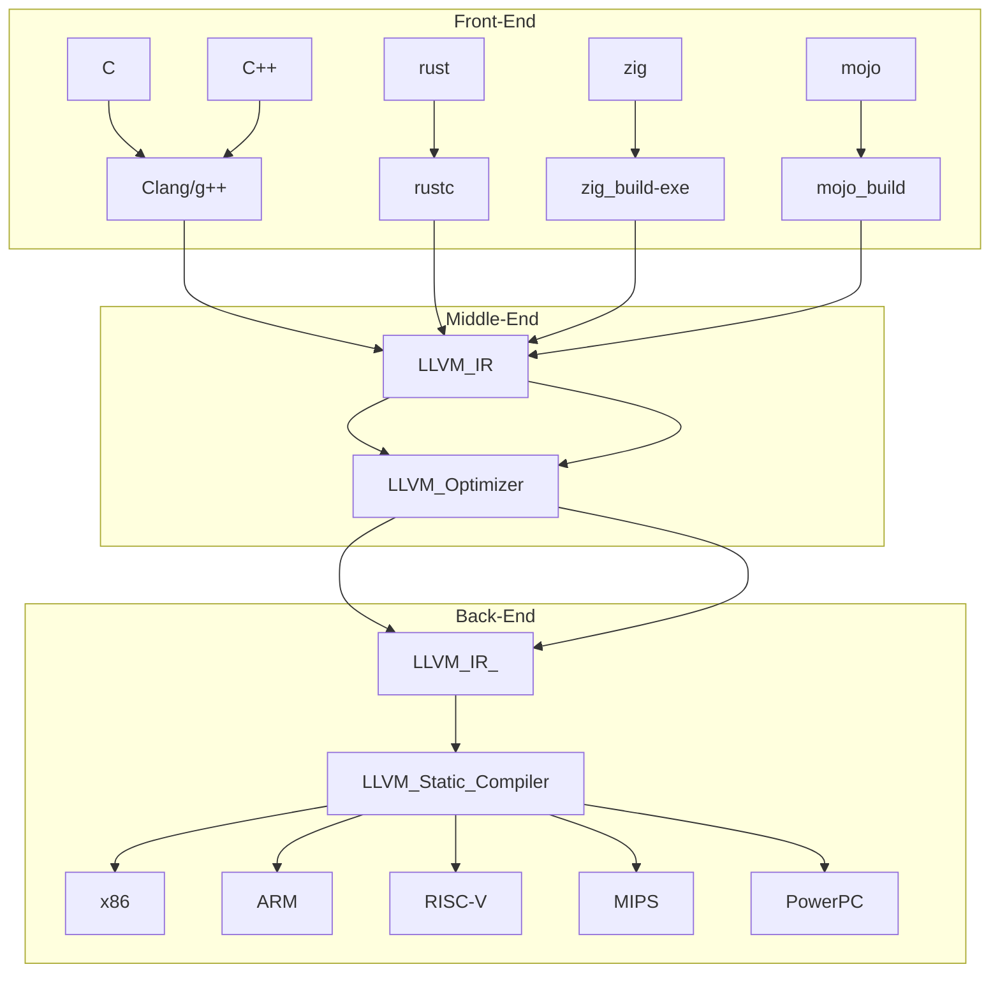

<hr>

# LLVM IR and Rust

```
llvm -> clang C언어 C++
g++
clangd -> C언어의 LSP 지원 -> 타입이 나온다.type

c / c++ / zig  / rust 

```

<li><strong><em>Front-end:</em></strong> compiles source language to IR.</li>

<li><strong><em>Middle-end:</em></strong> optimizes IR.
    
<li><strong><em>Back-end:</em></strong> compiles IR to machine code.


    
    

    
```
    ```mermaid
    lowchart TB
    LLVM_IR-->LLVM_Optimizer
    LLVM_Optimizer-->LLVM_IR_
    subgraph Back-End
    LLVM_IR_-->LLVM_Static_Compiler
    LLVM_Static_Compiler-->x86 & ARM & RISC-V & MIPS & PowerPC
    end
    subgraph Middle-End
    LLVM_IR-->LLVM_Optimizer
    LLVM_Optimizer-->LLVM_IR_
    end
    subgraph Front-End
    C & C++--> Clang/g++
    Clang/g++ --> LLVM_IR
    rust --> rustc
    rustc --> LLVM_IR
    zig--> zig_build-exe
    zig_build-exe --> LLVM_IR
    mojo --> mojo_build
    mojo_build --> LLVM_IR
    end
    
    ```
```

https://blog.gopheracademy.com/advent-2018/llvm-ir-and-go/
    
    
# Rust 더 자세한 Debugging __llvm 코드 보는법
    
- https://github.com/YoungHaKim7/Rust_Tutorial_Full_course/tree/main/22_Rust_Debugging_rust-lldb_rd
