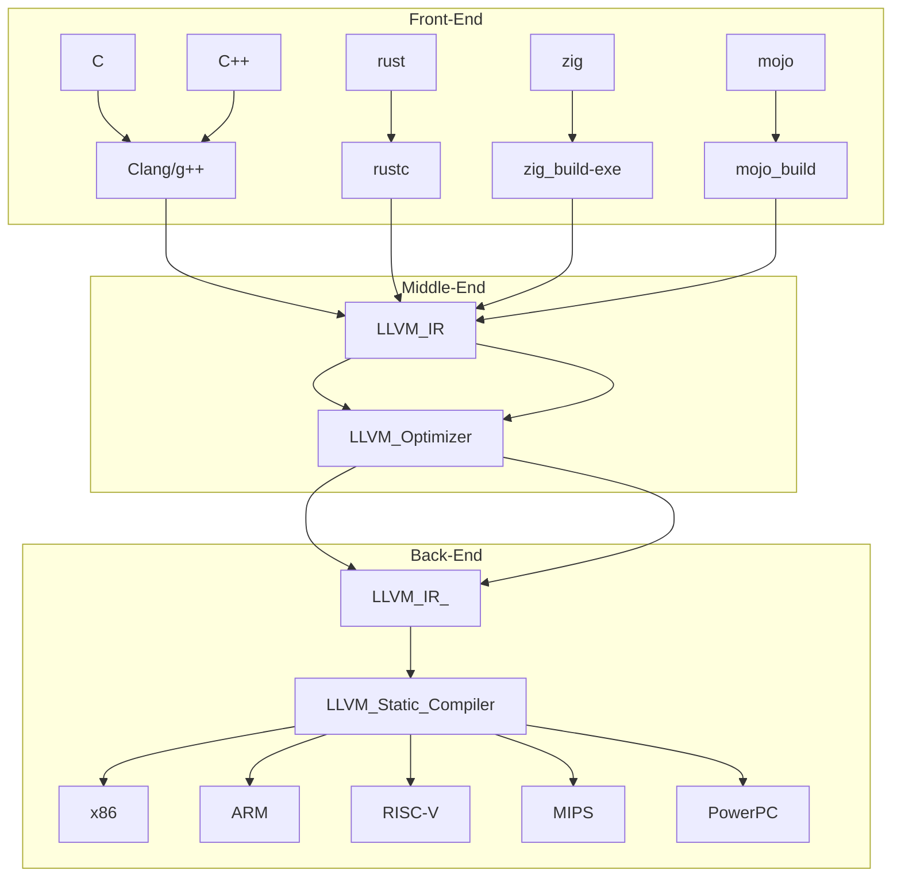

<p align="center">
  
</p>

- 출처 : https://blog.rust-lang.org/2016/04/19/MIR.html

<br>

- src/main.rs

```rs
use ndarray::{Array, Array1, ShapeBuilder};

fn main() {
    let a = Array::from_shape_vec((3, 3), Array1::range(0., 9., 1.).to_vec());
    let b = Array::from_shape_vec((2, 2).strides((1, 2)), vec![1., 2., 3., 4.]).unwrap();
    println!("create array 01 bool : {:?}", a.is_ok());
    println!("create array : {:?}", b);
}

```

- cargo rustc -- -Zunpretty=hir
```bash
cargo rustc -- -Zunpretty=hir

info: syncing channel updates for 'nightly-x86_64-pc-windows-msvc'
info: latest update on 2024-01-09, rust version 1.77.0-nightly (ca663b06c 2024-01-08)
info: installing component 'rustfmt'
   Compiling autocfg v1.1.0
   Compiling rawpointer v0.2.1
   Compiling num-traits v0.2.17
   Compiling num-integer v0.1.45
   Compiling matrixmultiply v0.3.8
   Compiling num-complex v0.4.4
   Compiling ndarray v0.15.6
   Compiling testrust01 v0.1.0 (D:\young_linux\11111\testrust01)
#[prelude_import]
use std::prelude::rust_2021::*;
#[macro_use]
extern crate std;
use ndarray::{};
use ndarray::Array;
use ndarray::Array1;
use ndarray::ShapeBuilder;

fn main() {
        let a =
            Array::from_shape_vec((3, 3), Array1::range(0., 9., 1.).to_vec());
        let b =
            Array::from_shape_vec((2, 2).strides((1, 2)),
                    <[_]>::into_vec(
                        #[rustc_box]
                        ::alloc::boxed::Box::new([1., 2., 3., 4.]))).unwrap();
        {
                ::std::io::_print(format_arguments::new_v1(&["create array 01 bool : ",
                                    "\n"], &[format_argument::new_debug(&a.is_ok())]));
            };
        {
                ::std::io::_print(format_arguments::new_v1(&["create array : ",
                                    "\n"], &[format_argument::new_debug(&b)]));
            };
    }
    Finished dev [unopt
```

- cargo asm
  - https://github.com/gnzlbg/cargo-asm

- ```cargo asm --mir```

```bash
$ cargo asm --mir
   Compiling trait_impl v0.1.0 (/Users/globalyoung/Documents/test/test/YouTubeContents_GlobalYoung/230317_Rust_Monomorphization_vs_Polymorphism/Polymorphism/trait_impl)
    Finished release [optimized] target(s) in 0.09s

Try one of those by name or a sequence number
 0 "fn <impl at src/main.rs:13:1: 13:23>::growl(_1: &Tiger)" [63]
 1 "fn <impl at src/main.rs:20:1: 20:22>::growl(_1: &Bear)" [63]
 2 "fn <impl at src/main.rs:6:1: 6:22>::growl(_1: &Lion)" [65]
 3 "fn main()" [46]
 4 "fn static_dispatch(_1: T)" [34]
 5 "promoted[0] in <impl at src/main.rs:13:1: 13:23>::growl: &[ArgumentV1<'_>; 0]" [10]
 6 "promoted[0] in <impl at src/main.rs:20:1: 20:22>::growl: &[ArgumentV1<'_>; 0]" [10]
 7 "promoted[0] in <impl at src/main.rs:6:1: 6:22>::growl: &[ArgumentV1<'_>; 0]" [10]
 8 "promoted[1] in <impl at src/main.rs:13:1: 13:23>::growl: &[&str; 1]" [13]
 9 "promoted[1] in <impl at src/main.rs:20:1: 20:22>::growl: &[&str; 1]" [13]
10 "promoted[1] in <impl at src/main.rs:6:1: 6:22>::growl: &[&str; 1]" [13]
```

- ```cargo asm --llvm```

```bash
$cargo asm --llvm
   Compiling trait_impl v0.1.0 (/Users/globalyoung/Documents/test/test/YouTubeContents_GlobalYoung/230317_Rust_Monomorphization_vs_Polymorphism/Polymorphism/trait_impl)
    Finished release [optimized] target(s) in 0.09s

Try one of those by name or a sequence number
0 "<trait_impl::Bear as trait_impl::Growler>::growl" [20]
1 "<trait_impl::Lion as trait_impl::Growler>::growl" [20]
2 "<trait_impl::Tiger as trait_impl::Growler>::growl" [20]
3 "Function Attrs: uwtable" [23]
4 "core::ops::function::FnOnce::call_once{{vtable.shim}}" [9]
5 "core::ptr::drop_in_place<std::rt::lang_start<()>::{{closure}}>" [6]
6 "std::rt::lang_start" [12]
7 "std::rt::lang_start::{{closure}}" [9]
8 "std::sys_common::backtrace::__rust_begin_short_backtrace" [8]
9 "trait_impl::main" [12]
```

- cargo hir
  - https://gist.github.com/niklasad1/b838695ef436a0a16d5cd80cf462905f

# Expand macros
`$ cargo rustc -- --pretty expanded -Z unstable-options`

# Emit asm
`$ cargo rustc -- --emit asm && cat target/debug/deps/project_name-hash.s`

# Emit llvm-ir
`$ cargo rustc -- --emit llvm-ir && cat target/debug/deps/project_name-hash.ll`

# Emit HIR
`$ cargo rustc -- -Zunpretty=hir`

# Emit MIR
`$ cargo rustc -- -Zunpretty=mir`


<hr>


- Rust 1.74.0: All 45 changes in 19 minutes! | Nathan Stocks(6min 36sec)
  - https://youtu.be/MOzuShpnUm8?si=GArUM-7CqH6TVbeD


<hr>

# LLVM IR and Rust

```
llvm -> clang C언어 C++
g++
clangd -> C언어의 LSP 지원 -> 타입이 나온다.type

c / c++ / zig  / rust 

```

<li><strong><em>Front-end:</em></strong> compiles source language to IR.</li>

<li><strong><em>Middle-end:</em></strong> optimizes IR.
    
<li><strong><em>Back-end:</em></strong> compiles IR to machine code.


    
    

    
```
    ```mermaid
    lowchart TB
    LLVM_IR-->LLVM_Optimizer
    LLVM_Optimizer-->LLVM_IR_
    subgraph Back-End
    LLVM_IR_-->LLVM_Static_Compiler
    LLVM_Static_Compiler-->x86 & ARM & RISC-V & MIPS & PowerPC
    end
    subgraph Middle-End
    LLVM_IR-->LLVM_Optimizer
    LLVM_Optimizer-->LLVM_IR_
    end
    subgraph Front-End
    C & C++--> Clang/g++
    Clang/g++ --> LLVM_IR
    rust --> rustc
    rustc --> LLVM_IR
    zig--> zig_build-exe
    zig_build-exe --> LLVM_IR
    mojo --> mojo_build
    mojo_build --> LLVM_IR
    end
    
    ```
```

https://blog.gopheracademy.com/advent-2018/llvm-ir-and-go/
    
    
# Rust 더 자세한 Debugging __llvm 코드 보는법
    
- https://github.com/YoungHaKim7/Rust_Tutorial_Full_course/tree/main/22_Rust_Debugging_rust-lldb_rd
