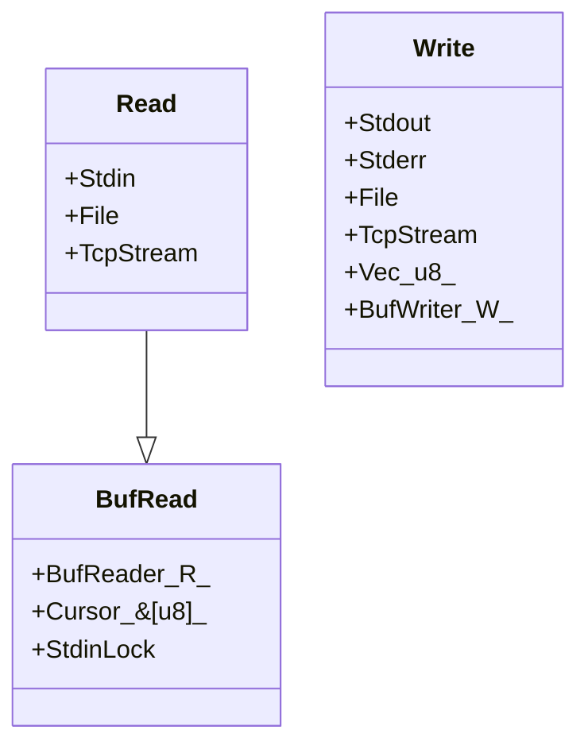

# 러스트의 세 가지 주요 I/O Trait 와 이를 구현하고 있는 몇 가지 타입들


- 출처 : https://product.kyobobook.co.kr/detail/S000200629958

- https://doc.rust-lang.org/stable/std/io/struct.Stdin.html 
- https://doc.rust-lang.org/stable/std/fs/struct.File.html 

- code(mermaid)
  - https://mermaid.js.org/

```code
classDiagram
    Read --|> BufRead
    Write 
    class Write{
      +Stdout
      +Stderr
      +File
      +TcpStream
      +Vec&lt;u8&gt;
      +BufWriter&lt;W&gt;
    }
    class Read{
      +Stdin
      +File
      +TcpStream
    }
    class BufRead{
      +BufReader&lt;R&gt;
      +Cursor&lt;&[u8]&gt;
      +StdinLock
    }
```

- Read vs Write

```rs
Read
  Stdin
  File
  TcpStream

  BufRead
    BufReader<R>
    Cursor<&[u8]>
    StdinLock
```

```rs
Write
  Stdout
  Stderr
  File
  TcpStream
  Vec<u8>
  BufWriter<W>

```
